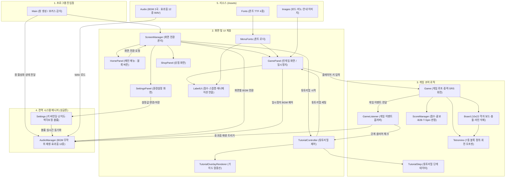

# Java Tetris Project

Java Swing으로 만든 테트리스 게임 프로젝트입니다.

## 최신 구조도 (Architecture)

### 주요 컴포넌트 역할

| 계층 | 클래스 / 파일 | 역할 및 주요 기능 |
|---|---|---|
| **진입점** | [`Main.java`](file:///Volumes/DevSSD/Developer/Projects/General/Java_Tetris_Project/src/Main.java) | 프로그램 시작점. Swing 스레드에서 JFrame 생성 및 창 포커스 감지 |
| **UI** | [`ScreenManager.java`](file:///Volumes/DevSSD/Developer/Projects/General/Java_Tetris_Project/src/ScreenManager.java) | CardLayout 기반 화면 전환(메뉴/게임/튜토리얼/설정/상점) 및 BGM 모드 전환 |
| | [`HomePanel.java`](file:///Volumes/DevSSD/Developer/Projects/General/Java_Tetris_Project/src/HomePanel.java) | 테트로미노 모양의 인터랙티브 버튼으로 구성된 메인 로비 화면 |
| | [`GamePanel.java`](file:///Volumes/DevSSD/Developer/Projects/General/Java_Tetris_Project/src/GamePanel.java) | 게임 화면 렌더링, 키 바인딩, 16ms 게임 타이머, 일시정지(ESC) 오버레이 |
| | [`LabelUI.java`](file:///Volumes/DevSSD/Developer/Projects/General/Java_Tetris_Project/src/LabelUI.java) | SINGLE/DOUBLE/TRIPLE/TETRIS, B2B, T-SPIN, ALL CLEAR 연출 렌더러 |
| | [`SettingsPanel.java`](file:///Volumes/DevSSD/Developer/Projects/General/Java_Tetris_Project/src/SettingsPanel.java) | 키 바인딩 변경, 난이도, 색각 이상 보정 팔레트, 사운드 볼륨 슬라이더 UI |
| | [`ShopPanel.java`](file:///Volumes/DevSSD/Developer/Projects/General/Java_Tetris_Project/src/ShopPanel.java) | 상점 화면 (준비 중 안내 및 뒤로가기) |
| | [`TutorialController.java`](file:///Volumes/DevSSD/Developer/Projects/General/Java_Tetris_Project/src/TutorialController.java) | 튜토리얼 3단계(이동/회전/라인삭제) 진행 제어 및 완료 처리 |
| | [`TutorialOverlayRenderer.java`](file:///Volumes/DevSSD/Developer/Projects/General/Java_Tetris_Project/src/TutorialOverlayRenderer.java) | 튜토리얼 진행 단계와 안내 텍스트 말풍선 렌더링 |
| | [`MenuFonts.java`](file:///Volumes/DevSSD/Developer/Projects/General/Java_Tetris_Project/src/MenuFonts.java) | 커스텀 TTF 폰트(Orbitron, Inter, PressStart2P, SansKR) 로더 및 캐싱 |
| **코어** | [`Game.java`](file:///Volumes/DevSSD/Developer/Projects/General/Java_Tetris_Project/src/Game.java) | SRS 슈퍼 로테이션 시스템, 7-bag 생성기, 중력 낙하, 락 딜레이, 홀드 처리 |
| | [`Board.java`](file:///Volumes/DevSSD/Developer/Projects/General/Java_Tetris_Project/src/Board.java) | 10x22 격자 보드(숨김 2행), 블록 배치 가능 여부(충돌 판정), 라인 삭제 |
| | [`Tetromino.java`](file:///Volumes/DevSSD/Developer/Projects/General/Java_Tetris_Project/src/Tetromino.java) | 7종 테트로미노(I, O, T, S, Z, J, L) 형태 정의 및 회전별 좌표 |
| | [`ScoreManager.java`](file:///Volumes/DevSSD/Developer/Projects/General/Java_Tetris_Project/src/ScoreManager.java) | 점수 계산, 레벨 계산, 콤보, 백투백(B2B), T-스핀 판정, easeOut 자간 애니메이션 |
| | [`GameListener.java`](file:///Volumes/DevSSD/Developer/Projects/General/Java_Tetris_Project/src/GameListener.java) | 게임 내 이동/회전/드롭/고정/라인삭제/레벨업/게임오버 옵저버 인터페이스 |
| | [`PieceGenerator.java`](file:///Volumes/DevSSD/Developer/Projects/General/Java_Tetris_Project/src/PieceGenerator.java) | 테트로미노 생성 인터페이스 (기본 7-bag 및 튜토리얼 고정 생성기 지원) |
| | [`TutorialStep.java`](file:///Volumes/DevSSD/Developer/Projects/General/Java_Tetris_Project/src/TutorialStep.java) | 튜토리얼 단계별 목표 규칙, 허용 입력 및 고정 미노 시퀀스 데이터 |
| **매니저** | [`Settings.java`](file:///Volumes/DevSSD/Developer/Projects/General/Java_Tetris_Project/src/Settings.java) | 싱글톤 환경설정 모델. 키 세팅, 난이도 중력 배율, 볼륨, 프로필 자동 저장 |
| | [`AudioManager.java`](file:///Volumes/DevSSD/Developer/Projects/General/Java_Tetris_Project/src/AudioManager.java) | BGM A/B 랜덤 전환 및 루프, 12종 효과음 재생, 연타 소리 찢어짐 방지, 볼륨 연동 |
| **에셋** | [`Audio/`](file:///Volumes/DevSSD/Developer/Projects/General/Java_Tetris_Project/Audio) | 인게임/메뉴 BGM 2곡 + 조작/클리어/레벨업 효과음 12종 WAV |
| | [`Fonts/`](file:///Volumes/DevSSD/Developer/Projects/General/Java_Tetris_Project/Fonts) | Orbitron, Inter, PressStart2P, SansKR 폰트 리소스 |
| | [`Images/`](file:///Volumes/DevSSD/Developer/Projects/General/Java_Tetris_Project/Images) | 보드 매트릭스, 미노 스프라이트, 가이드, 일시정지 안내 이미지 |

## 실행

IntelliJ IDEA에서 `src/Main.java`의 `Main.main()`을 실행합니다.

## 기여자

| 이름 | 전공 | 학번 |
|---|---|---|
| @김은수 | 소프트웨어공학과 | 202446684 |
| @김현민 | 소프트웨어공학과 | 202446685 |
| @이재혁 | 소프트웨어공학과 | 202446175 |
| @최유경 | 바이오메디컬공학부 | 202322343 |
