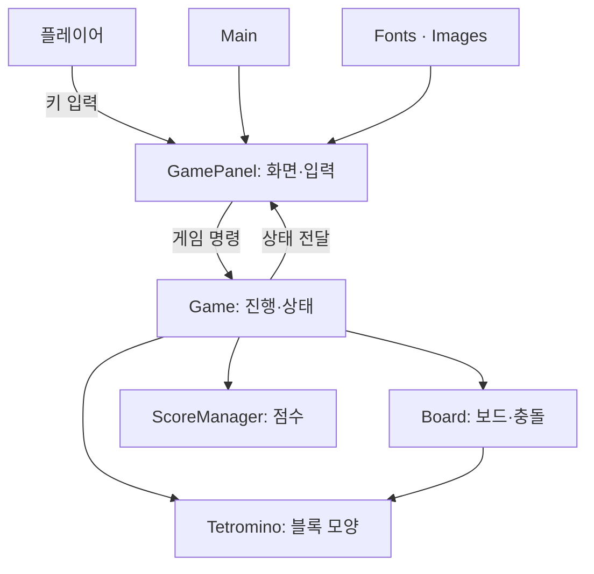

# Java Tetris Project

Java Swing으로 만든 테트리스 게임 프로젝트입니다.

## 구조도

## 실행

IntelliJ IDEA에서 `src/Main.java`의 `Main.main()`을 실행합니다.

## 기여자

| 이름 | 전공 | 학번 |
|---|---|---|
| @김은수 | 소프트웨어공학과 | 202446684 |
| @김현민 | 소프트웨어공학과 | 202446685 |
| @이재혁 | 소프트웨어공학과 | 202446175 |
| @최유경 | 바이오메디컬공학부 | 202322343 |
